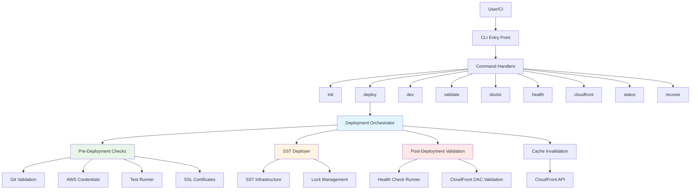
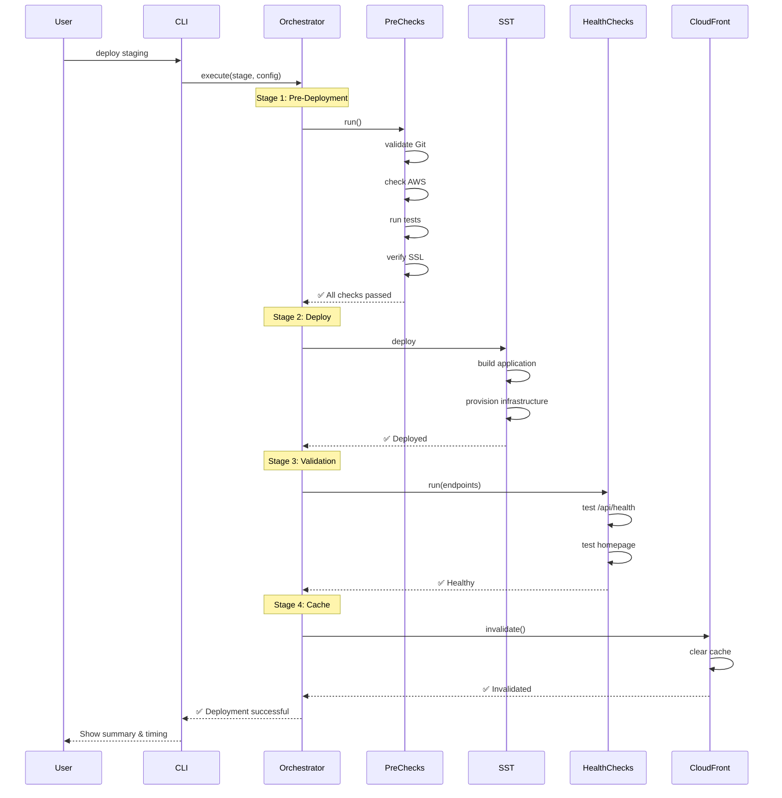
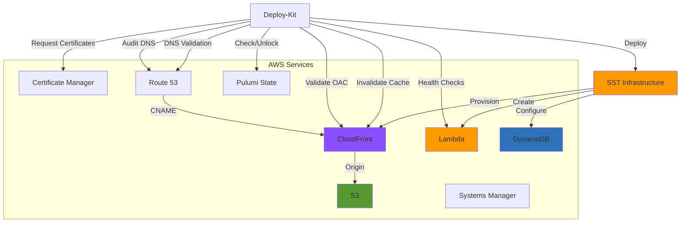
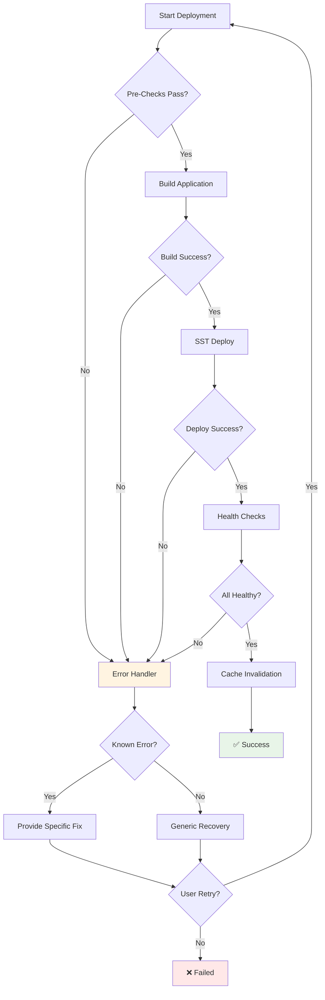
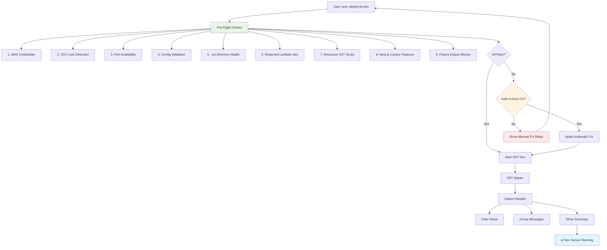
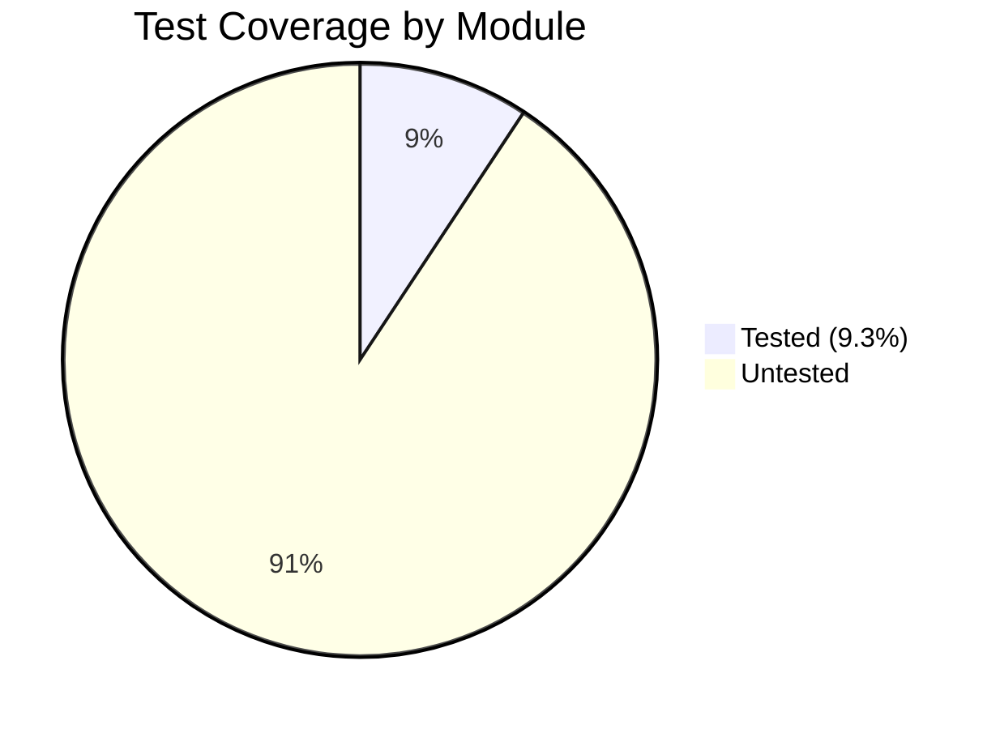

# Deploy-Kit Architecture

> **Version**: 2.7.0
> **Last Updated**: 2025-11-03

## Overview

Deploy-Kit is a production-grade deployment orchestration system for SST + Next.js + DynamoDB applications. It provides a comprehensive safety system with automated checks, intelligent error recovery, and sophisticated terminal UI.

## System Architecture

### High-Level Architecture



## Module Structure

### Core Modules

```mermaid
graph LR
    subgraph "Entry Point"
        CLI[cli.ts]
    end

    subgraph "Commands"
        Init[init/]
        Deploy[deploy]
        Dev[dev]
        Validate[validate]
        Doctor[doctor]
    end

    subgraph "Deployment"
        Orchestrator[orchestrator.ts]
        SSTDeployer[sst-deployer.ts]
        Coordinator[orchestration-coordinator.ts]
        DiffCollector[diff-collector.ts]
    end

    subgraph "Safety Systems"
        Locks[locks/]
        Health[health/]
        Recovery[recovery/]
    end

    subgraph "Infrastructure"
        Certificates[certificates/]
        CloudFrontMgr[cloudfront/]
        AWSState[aws-state-manager.ts]
    end

    subgraph "Utilities"
        Config[config-validator.ts]
        Profile[aws-profile-detector.ts]
        Printer[deployment-printer.ts]
    end

    CLI --> Commands
    Commands --> Deployment
    Deployment --> Safety Systems
    Deployment --> Infrastructure
    Commands --> Utilities
    Deployment --> Utilities

    style Deployment fill:#e1f5ff
    style Safety Systems fill:#e8f5e8
    style Infrastructure fill:#fff4e1
    style Utilities fill:#f5f5f5
```

### Data Flow



## Module Dependencies

### Dependency Graph

```mermaid
graph TD
    CLI[cli.ts] --> Deployer[deployer.ts]
    CLI --> StatusChecker[status/checker.ts]
    CLI --> RecoveryManager[recovery/manager.ts]
    CLI --> Commands[cli/commands/]

    Commands --> Init[init/]
    Commands --> DevCmd[dev.ts]
    Commands --> ValidateCmd[validate.ts]
    Commands --> DoctorCmd[doctor.ts]
    Commands --> CloudFrontCmd[cloudfront.ts]

    Deployer --> Orchestrator[deployment/orchestrator.ts]
    Orchestrator --> SSTDeployer[deployment/sst-deployer.ts]
    Orchestrator --> PreChecks[safety/pre-checks.ts]
    Orchestrator --> HealthRunner[health/runner.ts]
    Orchestrator --> CacheInvalidator[lib/cloudfront/invalidator.ts]

    SSTDeployer --> LockManager[locks/manager.ts]
    SSTDeployer --> AWSStateManager[deployment/aws-state-manager.ts]

    DevCmd --> PreFlightChecks[cli/dev-checks/]
    DevCmd --> SSTStarter[cli/dev-checks/sst-starter.ts]
    DevCmd --> OutputHandler[cli/dev-checks/sst-output-handler.ts]

    PreFlightChecks --> AWSCheck[aws-credentials.ts]
    PreFlightChecks --> LockCheck[sst-lock-detection.ts]
    PreFlightChecks --> PortCheck[port-availability.ts]
    PreFlightChecks --> ConfigCheck[config-validation.ts]

    Init --> ConfigValidator[cli/utils/config-validator.ts]
    Init --> ProfileDetector[cli/utils/aws-profile-detector.ts]

    HealthRunner --> OACValidator[lib/cloudfront/oac-validator.ts]

    CloudFrontCmd --> CloudFrontAPI[lib/cloudfront/client.ts]
    CloudFrontCmd --> DNSChecker[lib/dns/checker.ts]

    style Deployer fill:#e1f5ff
    style Orchestrator fill:#e1f5ff
    style DevCmd fill:#fff4e1
    style PreFlightChecks fill:#e8f5e8
    style Commands fill:#f5e1ff
```



### Module Responsibilities

#### CLI Layer (`src/cli.ts`)
- **Purpose**: Entry point for all commands
- **Responsibilities**:
  - Argument parsing
  - Command routing
  - Top-level error handling
  - User-facing output

#### Command Handlers (`src/cli/commands/`)
- **Purpose**: Individual command implementations
- **Modules**:
  - `init/` - Project setup wizard
  - `dev.ts` - Development server with pre-flight checks
  - `validate.ts` - Configuration validation
  - `doctor.ts` - System diagnostics
  - `cloudfront.ts` - CloudFront management

#### Deployment Core (`src/deployment/`)
- **Purpose**: Deployment orchestration and execution
- **Key Files**:
  - `orchestrator.ts` - 5-stage deployment pipeline
  - `sst-deployer.ts` - SST integration layer
  - `orchestration-coordinator.ts` - Async operation coordination
  - `aws-state-manager.ts` - AWS resource state management
  - `diff-collector.ts` - Pre-deployment diff analysis

#### Safety Systems (`src/safety/`, `src/locks/`, `src/health/`)
- **Purpose**: Deployment safety guarantees
- **Components**:
  - Pre-deployment checks (git, AWS, tests, SSL)
  - Lock management (prevents concurrent deploys)
  - Health check runner
  - Recovery procedures

#### Infrastructure Modules (`src/lib/`)
- **Purpose**: AWS service integrations
- **Modules**:
  - `cloudfront/` - CloudFront API, OAC validation, cache invalidation
  - `certificates/` - ACM SSL certificate management
  - `dns/` - Route 53 integration
  - `domain-utils.ts` - Domain validation

#### Dev Command System (`src/cli/dev-checks/`)
- **Purpose**: Development server with comprehensive pre-flight checks
- **Features**:
  - 8 automated pre-flight checks
  - Intelligent error detection (recursive scripts, Next.js canary features, Pulumi outputs)
  - Hybrid auto-fix system (safe auto-fixes, risky manual-only)
  - SST output filtering and grouping
  - Port conflict resolution

## AWS Service Integration



## Error Handling & Recovery



### Error Recovery Patterns

Deploy-Kit includes intelligent error recovery for common deployment issues:

1. **SSL Certificate Errors**
   - Pattern: "certificate is in use"
   - Fix: Auto-inject certificate ARN, update DNS validation

2. **Git Status Errors**
   - Pattern: "dirty working directory"
   - Fix: Guide user to commit/stash changes

3. **AWS Credential Errors**
   - Pattern: "credentials not configured"
   - Fix: Provide `aws configure` command with detected profile

4. **Test Failures**
   - Pattern: "tests failing"
   - Fix: Show test output, suggest fixing before deploy

5. **CloudFront OAC Errors**
   - Pattern: "403 Forbidden"
   - Fix: Validate OAC configuration, check S3 bucket policy

6. **Pulumi State Lock Errors**
   - Pattern: "lock held"
   - Fix: Auto-unlock if stale, validate lock owner

## Performance Characteristics

### Deployment Stages Timing (Typical)

| Stage | Operation | Average Time | Notes |
|-------|-----------|--------------|-------|
| 1 | Pre-Deployment Checks | 5-15s | Git, AWS, tests, SSL validation |
| 2 | Build & Deploy | 120-300s | Next.js build + SST provisioning |
| 3 | Health Checks | 10-30s | Endpoint validation, OAC checks |
| 4 | Cache Invalidation | 2-5s | CloudFront invalidation request |
| 5 | Propagation | 5-15min | Background (non-blocking) |

### Configuration Validation Performance

- **validateConfig()**: 1.9M ops/sec
- **mergeConfigs()**: 1.6M ops/sec
- **Domain validation**: 3.9M ops/sec

> Performance tests ensure deployment CLI remains instant and responsive.

## Lock Management System

```mermaid
stateDiagram-v2
    [*] --> CheckLocks: Start Deployment

    CheckLocks --> FileLock{File Lock Exists?}
    FileLock --> Expired{Lock Expired?}: Yes
    FileLock --> PulumiLock: No

    Expired --> ClearFileLock: Yes (>2 hours)
    Expired --> BlockDeploy: No (recent)

    ClearFileLock --> PulumiLock

    PulumiLock --> PulumiCheck{Pulumi Locked?}
    PulumiCheck --> UnlockPulumi: Yes
    PulumiCheck --> CreateLock: No

    UnlockPulumi --> CreateLock

    CreateLock --> Deploy: Acquire locks
    Deploy --> HealthCheck
    HealthCheck --> ReleaseLocks

    ReleaseLocks --> [*]: Success

    BlockDeploy --> [*]: Blocked
```

### Dual-Lock Design

1. **File-Based Lock** (`.deployment-lock-{stage}`)
   - Prevents concurrent human-triggered deployments
   - Auto-expires after 2 hours
   - Contains: deployer, timestamp, stage

2. **Pulumi State Lock**
   - Prevents infrastructure state corruption
   - Auto-cleared at deployment start if stale
   - Integrated with SST deployment flow

## Development Server Architecture



## Security Model

### Credential Management

- **AWS Profiles**: Resolved in order:
  1. Explicit `--profile` flag
  2. Config file `awsProfile`
  3. Auto-detected from `sst.config.ts`
  4. Default AWS profile

### Lock Security

- Deployment locks include deployer identity
- Auto-expiration prevents permanent blocks
- Manual override requires admin confirmation

### Health Check Security

- SSL/TLS validation enforced
- Origin Access Control (OAC) validation
- S3 bucket policy verification
- No credentials in health check responses

## Extensibility Points

### Custom Deployment Scripts

```json
{
  "customDeployScript": "./scripts/deploy.sh"
}
```

### Lifecycle Hooks

```json
{
  "hooks": {
    "preDeploy": "npm test",
    "postBuild": "npm run build",
    "postDeploy": "npm run verify",
    "onError": "npm run rollback"
  }
}
```

### Health Check Customization

```json
{
  "healthChecks": [
    {
      "url": "/api/health",
      "expectedStatus": 200,
      "timeout": 5000,
      "searchText": "OK"
    }
  ]
}
```

## Testing Architecture

### Test Coverage (Current: 9.3% → Target: 30%)



### Test Layers

1. **Unit Tests** - Pure functions, validators, utilities
2. **Integration Tests** - AWS interactions, SST deployment
3. **E2E Tests** - Full deployment workflows
4. **Performance Tests** - Config validation, domain checks

### Critical Untested Modules

- `deployment/orchestrator.ts` - Deployment pipeline
- `deployment/sst-deployer.ts` - SST integration
- `deployment/orchestration-coordinator.ts` - Async coordination

## Future Architecture Improvements

### Planned Enhancements

1. **Plugin System** - Extensible deployment engines
2. **Blue-Green Deployments** - Zero-downtime updates
3. **Distributed Tracing** - Full deployment observability
4. **Persistent History** - S3/DynamoDB audit logs

### Scalability Targets

- Support multi-project workspaces
- Parallel deployment orchestration
- Deployment queue management
- Rate-limited AWS API calls

---

**See Also**:
- [Deployment Workflow](./deployment-workflow.md)
- [AWS Integration Guide](./aws-integration.md)
- [Dev Command Documentation](./dev-command.md)
- [Best Practices](./best-practices.md)
