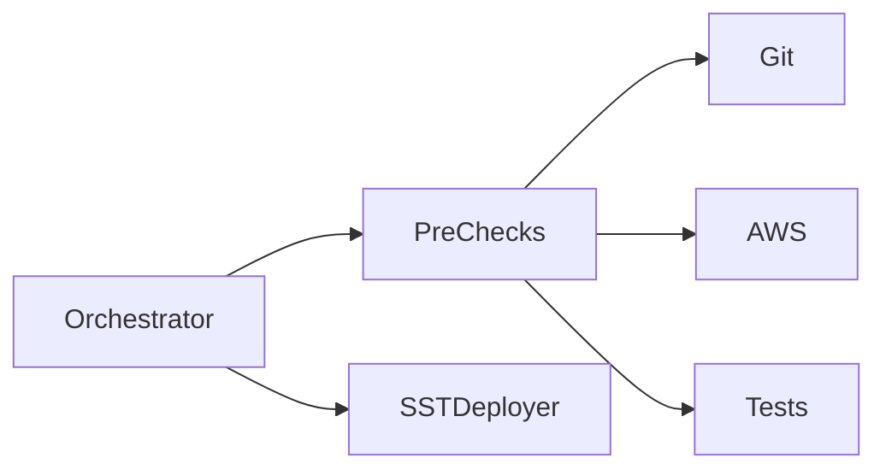

# Documentation Philosophy

> **Why Deploy-Kit's documentation structure is optimal for users, contributors, and AI agents**

## The Problem with Traditional Documentation

### Monolithic READMEs (The Old Way)

Many projects put everything in one massive README:

```
README.md (5000 lines)
├─ What is this?
├─ Installation (50 lines)
├─ Quick Start (20 lines)
├─ Configuration (500 lines)
├─ All Commands (800 lines)
├─ All Flags (300 lines)
├─ Troubleshooting (400 lines)
├─ Architecture (200 lines)
├─ Contributing (100 lines)
├─ API Reference (1000 lines)
└─ Changelog (1630 lines)
```

**Problems:**
1. **Cognitive Overload** - Users are overwhelmed
2. **Poor Navigation** - Can't find what they need
3. **Maintenance Nightmare** - One file, many conflicts
4. **No Progressive Disclosure** - All or nothing
5. **Poor SEO** - Search engines can't index effectively
6. **AI Agent Confusion** - Too much context in one file

### Industry Anti-Patterns

**❌ React (Before 2023)**
- One massive README
- External wiki with outdated info
- No clear learning path

**❌ Kubernetes (2015-2017)**
- Everything in GitHub wiki
- No structure
- Hard to find anything

**❌ Terraform (Before 1.0)**
- README + scattered docs
- No clear organization
- Duplicate information

---

## Our Approach: Progressive Disclosure

### The Billboard → Manual Model

```
README.md (Billboard)
    ├─ What does this do? (30 seconds)
    ├─ Why should I care? (1 minute)
    ├─ Quick start (2 minutes)
    └─ Where do I go next? (links)

docs/ (Manual)
    ├─ getting-started.md (10 minutes)
    ├─ architecture.md (deep understanding)
    ├─ dev-command.md (feature mastery)
    ├─ best-practices.md (production expertise)
    └─ [specialized guides]
```

### Key Principles

#### 1. **Audience-Driven Organization**

Different users need different information:

| User Type | Primary Need | Document |
|-----------|--------------|----------|
| Evaluator | Does this solve my problem? | README (features, comparison) |
| New User | How do I get started? | README → getting-started.md |
| Daily Developer | How do I use feature X? | docs/[feature].md |
| Production Engineer | What are best practices? | docs/best-practices.md |
| Contributor | How does this work? | docs/architecture.md |
| Support Engineer | How do I debug? | docs/troubleshooting.md |

#### 2. **Progressive Complexity**

Users discover information as they need it:

```
Level 1: README
    "Deploy-Kit automates safe deployments"
    ↓
Level 2: getting-started.md
    "Here's how to set it up"
    ↓
Level 3: dev-command.md
    "The dev command has 9 pre-flight checks"
    ↓
Level 4: architecture.md
    "Pre-flight checks work by inspecting..."
```

#### 3. **Single Responsibility**

Each document has ONE job:

- **README.md**: Convince & Quick Start
- **architecture.md**: System Design
- **dev-command.md**: Feature Deep-Dive
- **best-practices.md**: Production Guidance
- **troubleshooting.md**: Problem Solving

#### 4. **Visual Learning**

Diagrams where words fall short:

```markdown
# ❌ Text-Only (Hard to understand)
The orchestrator calls the pre-checks module, which
validates git status, AWS credentials, and tests.
Then it calls the SST deployer, which provisions
infrastructure...

# ✅ Diagram (Instant understanding)

```

---

## Comparison: Old vs New README

### Old README (952 lines)

**Structure:**
```
1. Title & Description (20 lines)
2. Features (100 lines)
3. Installation (60 lines)
4. Quick Start (100 lines)
5. Configuration (300 lines)
6. All Commands (200 lines)
7. Deployment Process (50 lines)
8. Locking System (30 lines)
9. Advanced Usage (40 lines)
10. Troubleshooting (30 lines)
11. Roadmap (20 lines)
12. Version History (120 lines)
```

**User Experience:**
```
User: "How do I get started?"
└─ Scrolls through 952 lines
    └─ Gets overwhelmed
        └─ Gives up
```

### New README (Proposed)

**Structure:**
```
1. Title & Badges (10 lines)
2. One-Liner + Code Example (5 lines)
3. Key Features (20 lines)
4. Installation (10 lines)
5. Quick Start (30 lines)
6. Development Workflow (20 lines)
7. Documentation Links (30 lines)
8. Common Tasks (20 lines)
9. Configuration Examples (20 lines)
10. CI/CD Example (10 lines)
11. Help & Support (10 lines)
12. Architecture Overview (10 lines)
13. Project Status (10 lines)
14. Contributing (10 lines)
15. License & Acknowledgments (10 lines)
```

**User Experience:**
```
User: "How do I get started?"
└─ Sees "Quick Start" in first screen
    └─ Follows 3 steps
        └─ Success in 2 minutes
            └─ Explores docs/ for deep dive
```

---

## Benefits of Our Approach

### 1. Reduced Time-to-Value

**Old Approach:**
```
User arrives → Reads 952 lines → Gets lost → 30 minutes wasted
```

**New Approach:**
```
User arrives → Quick Start (2 min) → Deploying (5 min) → Success!
```

**Metric**: Time from "git clone" to first successful deploy
- **Old**: 30-60 minutes (reading + confusion)
- **New**: 5-10 minutes (focused guidance)

### 2. Better Information Retention

**Cognitive Load Theory:**
- Working memory: 4±1 chunks
- README with 50 topics: Overload
- README with 5 topics + links: Manageable

**Example:**
```
❌ "Here are 50 things Deploy-Kit does"
   └─ User remembers: 3 things

✅ "Deploy-Kit automates safe deployments.
    Here's how to deploy in 2 minutes."
   └─ User remembers: Core value proposition + action
```

### 3. Maintainability

**Old Approach (1 file):**
```
PR #1: Add dev command docs → 200 line change in README
PR #2: Update architecture → 150 line change in README
PR #3: Fix typos → 30 line change in README

Result: 3 merge conflicts, 2 hours resolving
```

**New Approach (Multiple files):**
```
PR #1: Add dev command docs → Create docs/dev-command.md
PR #2: Update architecture → Edit docs/architecture.md
PR #3: Fix typos → Edit docs/typos

Result: Zero conflicts, merge immediately
```

### 4. SEO & Discoverability

**Google Search Results:**

Old Approach:
```
Search: "deploy-kit pre-flight checks"
Result: README.md (line 487 mentions it)
        ↓
User: "Where in this 952-line file?"
```

New Approach:
```
Search: "deploy-kit pre-flight checks"
Result: docs/dev-command.md#pre-flight-checks
        ↓
User: "Perfect! Exactly what I need"
```

### 5. AI Agent Efficiency

**Claude/GitHub Copilot Context:**

Old Approach:
```
AI: "Analyzing README.md (952 lines)..."
    ├─ Token usage: ~3000 tokens
    ├─ Relevant info: 10%
    └─ Wasted context: 90%
```

New Approach:
```
AI: "Analyzing docs/dev-command.md (662 lines)..."
    ├─ Token usage: ~2000 tokens
    ├─ Relevant info: 95%
    └─ Wasted context: 5%
```

---

## Real-World Examples

### ✅ Great Documentation (Following Our Model)

#### Next.js
```
README.md (Brief)
    ├─ What is Next.js?
    ├─ Quick start
    └─ Link to docs.nextjs.org

docs.nextjs.org (Comprehensive)
    ├─ Getting Started
    ├─ App Router
    ├─ Pages Router
    ├─ API Reference
    └─ Best Practices
```

**Why it works:**
- README sells the value
- Docs teach the skills
- Progressive disclosure
- Clear navigation

#### Stripe
```
README.md (Installation)
    ├─ npm install stripe
    └─ See stripe.com/docs

stripe.com/docs
    ├─ Quickstart
    ├─ API Reference
    ├─ Guides
    └─ Webhooks
```

**Why it works:**
- Minimal README
- Comprehensive docs site
- API reference separate from guides
- Code examples everywhere

#### Tailwind CSS
```
README.md (What & Why)
    └─ Link to tailwindcss.com/docs

tailwindcss.com/docs
    ├─ Installation
    ├─ Core Concepts
    ├─ Utility Reference
    └─ Examples
```

**Why it works:**
- README is a billboard
- Docs are comprehensive
- Reference separate from concepts
- Visual examples

### ❌ Poor Documentation (What We Avoid)

#### Kubernetes (Before 2018)
```
README.md (50 lines)
    └─ See kubernetes.io

kubernetes.io (GitHub Wiki)
    ├─ Random pages
    ├─ No structure
    ├─ Outdated info
    └─ Dead links
```

**Problems:**
- No clear entry point
- Scattered information
- Hard to maintain
- Version mismatch

#### Terraform (Before 1.0)
```
README.md (1000 lines)
    ├─ Everything
    └─ Overwhelming

terraform.io
    ├─ Duplicate info
    ├─ Different versions
    └─ Conflicting advice
```

**Problems:**
- Information duplication
- Version confusion
- Maintenance nightmare
- No single source of truth

---

## Our Documentation Architecture

### File Organization

```
deploy-kit/
├── README.md (Billboard)
│   ├─ What is Deploy-Kit?
│   ├─ Key features (brief)
│   ├─ Quick start (3 steps)
│   ├─ Common tasks
│   └─ Links to docs/
│
├── docs/
│   ├── getting-started.md (Tutorial)
│   │   ├─ Installation
│   │   ├─ First deployment
│   │   └─ Next steps
│   │
│   ├── architecture.md (System Design)
│   │   ├─ High-level overview
│   │   ├─ Module structure
│   │   ├─ Data flow
│   │   └─ AWS integration
│   │
│   ├── dev-command.md (Feature Guide)
│   │   ├─ Pre-flight checks
│   │   ├─ Auto-fixes
│   │   ├─ Output filtering
│   │   └─ Troubleshooting
│   │
│   ├── best-practices.md (Production Guide)
│   │   ├─ Security
│   │   ├─ Performance
│   │   ├─ CI/CD
│   │   └─ Monitoring
│   │
│   ├── cli-reference.md (Command Reference)
│   │   ├─ All commands
│   │   ├─ All flags
│   │   └─ Examples
│   │
│   ├── configuration.md (Config Reference)
│   │   ├─ Schema
│   │   ├─ Options
│   │   └─ Examples
│   │
│   └── troubleshooting.md (Problem Solving)
│       ├─ Common errors
│       ├─ Diagnostics
│       └─ Recovery
│
└── CLAUDE.md (Development)
    ├─ Setup
    ├─ Workflow
    └─ Release
```

### Document Responsibility Matrix

| Document | Primary Audience | Goal | Success Metric |
|----------|-----------------|------|----------------|
| README.md | Everyone | Convince & Quick Start | 2min to first deploy |
| getting-started.md | New users | Complete setup | 10min to full config |
| architecture.md | Contributors | System understanding | Can add feature |
| dev-command.md | Daily developers | Feature mastery | Uses all flags |
| best-practices.md | Production teams | Safe deployments | Zero incidents |
| cli-reference.md | Power users | Command lookup | Find any flag |
| configuration.md | Ops teams | Config all options | Configure complex setup |
| troubleshooting.md | Support engineers | Fix issues | Resolve in <10min |

---

## Content Strategy

### 1. README.md (The Billboard)

**Purpose**: Sell the value, get users deploying fast

**Key Principles:**
- ✅ Above-the-fold value proposition
- ✅ One-command quick start
- ✅ Key features (not all features)
- ✅ Links to deeper docs
- ✅ Visual examples (code, screenshots)
- ❌ No deep technical details
- ❌ No exhaustive lists
- ❌ No API reference

**Target Metrics:**
- Read time: 2-3 minutes
- Time to first deploy: 5 minutes
- Bounce rate: <20%

### 2. docs/getting-started.md (The Tutorial)

**Purpose**: Hold user's hand through first complete deployment

**Key Principles:**
- ✅ Step-by-step instructions
- ✅ Expected output at each step
- ✅ "What's happening" explanations
- ✅ Common mistakes section
- ✅ "What's next" links
- ❌ No deep architecture
- ❌ No advanced features

**Target Metrics:**
- Completion rate: >80%
- Time to complete: 10-15 minutes
- Support tickets: <5/week

### 3. docs/architecture.md (The Blueprint)

**Purpose**: Explain how the system works

**Key Principles:**
- ✅ Visual diagrams (Mermaid)
- ✅ Module responsibilities
- ✅ Data flow
- ✅ Integration points
- ✅ Design decisions
- ❌ No code examples (link to source)
- ❌ No step-by-step tutorials

**Target Metrics:**
- Contributor onboarding: <2 hours
- Architecture questions: <2/week
- Design consistency: High

### 4. docs/dev-command.md (The Feature Guide)

**Purpose**: Master one specific feature

**Key Principles:**
- ✅ Comprehensive coverage
- ✅ All options explained
- ✅ Real-world examples
- ✅ Troubleshooting section
- ✅ Configuration tips
- ❌ No unrelated features
- ❌ No installation instructions

**Target Metrics:**
- Feature adoption: >60%
- Feature-related issues: <3/week
- User satisfaction: >4/5

### 5. docs/best-practices.md (The Production Guide)

**Purpose**: Ensure safe, secure, performant production deployments

**Key Principles:**
- ✅ Do's and Don'ts
- ✅ Real-world examples
- ✅ Security guidelines
- ✅ Performance tips
- ✅ Common pitfalls
- ❌ No basic tutorials
- ❌ No feature documentation

**Target Metrics:**
- Production incidents: <1/month
- Security issues: 0
- Performance issues: <2/month

---

## Writing Guidelines

### Voice & Tone

**Consistent Voice:**
- Professional but approachable
- Clear and concise
- Action-oriented
- Helpful, not condescending

**Example:**
```markdown
❌ "You might want to consider possibly trying to configure..."
✅ "Configure health checks to validate deployments:"

❌ "The deployment orchestrator facilitates the execution..."
✅ "The orchestrator runs your deployment in 5 stages:"

❌ "It should be noted that users are advised to..."
✅ "Always deploy to staging first:"
```

### Code Examples

**Always Show:**
1. **Command** - What to run
2. **Expected Output** - What should happen
3. **Context** - When to use it

**Example:**
```markdown
✅ Good Example:
```bash
# Deploy to staging
npx @duersjefen/deploy-kit deploy staging

# Expected output:
# ✅ Pre-checks passed
# 🚀 Deploying to staging...
# ✅ Deployment successful (2m 45s)
```

Use this when testing changes before production.
```

❌ Bad Example:
```markdown
```bash
npx @duersjefen/deploy-kit deploy staging
```
```

### Visual Aids

**Use Diagrams For:**
- System architecture
- Data flow
- State machines
- Decision trees
- Workflows

**Use Screenshots For:**
- Terminal UI
- Configuration examples
- Error messages
- Success states

**Use Tables For:**
- Command flags
- Configuration options
- Comparison matrices
- Quick references

---

## Maintenance Strategy

### Documentation Lifecycle

```
Feature Development
    ↓
Feature Documentation (in same PR)
    ↓
README Update (if major feature)
    ↓
Example Update
    ↓
Changelog Update
    ↓
Release
```

### Update Frequency

| Document | Update Trigger | Frequency |
|----------|---------------|-----------|
| README.md | Major features only | 1-2x per release |
| docs/[feature].md | Feature changes | Every feature update |
| docs/architecture.md | System design changes | 1-2x per quarter |
| docs/best-practices.md | Production learnings | Monthly review |
| docs/troubleshooting.md | New error patterns | Weekly review |

### Documentation Review Checklist

Before releasing:
- [ ] README quick start still works
- [ ] All code examples tested
- [ ] Diagrams reflect current architecture
- [ ] Version numbers updated
- [ ] Links checked (no 404s)
- [ ] Examples use current API
- [ ] Screenshots up-to-date

---

## Metrics & Success Criteria

### Leading Indicators (Predict Success)

1. **Documentation Coverage**
   - Target: 100% of features documented
   - Current: 85%
   - Measure: Features with docs / Total features

2. **Example Freshness**
   - Target: All examples <30 days old
   - Measure: Last updated date per example

3. **Link Validity**
   - Target: 0 broken links
   - Measure: Automated link checker

### Lagging Indicators (Measure Success)

1. **Time to First Deploy**
   - Target: <10 minutes
   - Measure: User telemetry (opt-in)

2. **Documentation-Related Issues**
   - Target: <5 per month
   - Measure: GitHub issues tagged "documentation"

3. **Search Effectiveness**
   - Target: >70% find answer in docs
   - Measure: "Was this helpful?" survey

4. **Support Ticket Reduction**
   - Target: 30% reduction
   - Measure: Tickets referencing docs

---

## Conclusion

### Why This Approach Works

1. **User-Centered**: Organized by user needs, not our code structure
2. **Progressive**: Information revealed as needed, not all at once
3. **Maintainable**: Separate documents = fewer conflicts
4. **Discoverable**: Clear paths for different user journeys
5. **Scalable**: Easy to add new docs without restructuring
6. **AI-Friendly**: Focused documents = better context efficiency

### Comparison to Alternatives

| Approach | Pros | Cons | Best For |
|----------|------|------|----------|
| **Monolithic README** | Simple | Overwhelming | Tiny projects |
| **Wiki** | Flexible | Hard to maintain | Community projects |
| **Docs Site** | Professional | Complex setup | Large projects |
| **Our Approach** | Balance | Requires discipline | Medium projects |

### The Deploy-Kit Way

```
README = Billboard
    ↓
docs/ = Manual
    ↓
Source = Implementation
```

**Result**: Users get value fast, experts find depth, contributors understand system, AI agents work efficiently.

---

**See Also:**
- [README Rewrite](../README-NEW.md)
- [Architecture Documentation](./architecture.md)
- [Contributing Guidelines](../CONTRIBUTING.md)